# PDE4444 — ML Visual Quality Inspection

**Machine Learning for Engineers — Component A Technical Portfolio**

| | |
|---|---|
| **Author**   | Bilal Baslar |
| **Student**  | M01055955 |
| **Programme**| MSc Robotics, Middlesex University Dubai |
| **Module**   | PDE4444 — Machine Learning for Engineers |
| **Dataset**  | Defective vs Non-Defective Cup Images |
| **Final test fold** | 138 images, balanced 69 / 69 |

---

## 1. What this submission is

A reproducible study of binary visual-defect classification implemented as a
single-command pipeline that sweeps **seven** model families on the same
balanced test fold, from classical HOG baselines up to a pretrained YOLO26n
classifier. The narrative focuses on the **non-YOLO deep-learning path**
because that is where the engineering complexity — representation choice,
optimiser behaviour, transfer learning, regularisation — actually has to be
reasoned about. YOLO is reported as the strongest external reference model
but it is deliberately **not** the centre of the write-up.

Every number in this document is grounded in one of two canonical artefact
trees:

| Context | Path |
|---|---|
| Best pre-cleanup run (reference)     | [runs4/final_report_recheck/all_results.csv](../runs4/final_report_recheck/all_results.csv) |
| **Final, post-cleanup run**          | [runs5/final_report/all_results.csv](../runs5/final_report/all_results.csv) |
| Final YOLO-specific metrics          | [runs5/iter1_yolo/metrics.json](../runs5/iter1_yolo/metrics.json) |
| Final MLP-search trial log           | [runs5/iter1_mlp_search/trial_results.csv](../runs5/iter1_mlp_search/trial_results.csv) |

---

## 2. Assessment brief alignment

| Section | Requirement | Where it is implemented | Where its evidence lives |
|---|---|---|---|
| **S1** | Engineering problem definition | *(accompanying report)* | — |
| **S2** | Dataset, feature representation, dimensionality N | [prepare_dataset.py](prepare_dataset.py), [train_sklearn_baseline.py](train_sklearn_baseline.py) | §4 and §5 of this README |
| **S3** | Deep network (≥3 hidden layers, ≥2 activations) | [train_cnn_activation_sweep.py](train_cnn_activation_sweep.py), [train_keras_mlp_random_search.py](train_keras_mlp_random_search.py) | §6, §8 |
| **S3** | Zero-order / first-order / second-order optimisers + convergence plots | [train_optimizer_comparison.py](train_optimizer_comparison.py) | §7 |
| **S4** | Baseline comparison (SVM, sklearn MLP) | [train_sklearn_baseline.py](train_sklearn_baseline.py) | §5 |
| **S5** | Train / val / test split | [prepare_dataset.py](prepare_dataset.py) | §4 |
| **S5** | Cross-validation + overfitting analysis | [train_cross_validation.py](train_cross_validation.py) | §10 |

---

## 3. Reproducibility — one command

The canonical entrypoint is the orchestration script at the **repo root**:
[run_pipeline.py](../run_pipeline.py). It runs steps 0–9 end-to-end and is
resumable: every step is skipped if its output directory already exists, so
a failed run can be restarted in place.

```bash
cd /home/ubu/Desktop/Assessment
.venv/bin/python run_pipeline.py --runs-dir runs5
```

Common variants:

```bash
# Force a full re-run, overwriting previous outputs
.venv/bin/python run_pipeline.py --runs-dir runs5 --force

# Run only a subset (example: redo MLP search + MobileNet FT + aggregate)
.venv/bin/python run_pipeline.py --runs-dir runs5 --steps 4 6 9
```

### Step map

| # | Step | Script | Output under `--runs-dir` |
|---:|---|---|---|
| 0 | Balance raw classes + create train/val/test split | [scripts/balance_cleaned_dataset.py](../zeroq_cup_classification_scaffold/scripts/balance_cleaned_dataset.py) + [prepare_dataset.py](prepare_dataset.py) | `data_balanced/` |
| 1 | sklearn baselines (HOG + SVM, HOG + MLP) | [train_sklearn_baseline.py](train_sklearn_baseline.py) | `iter1_sklearn/` |
| 2 | CNN activation sweep (from scratch) | [train_cnn_activation_sweep.py](train_cnn_activation_sweep.py) | `iter1_cnn_activation/` |
| 3 | Optimiser comparison (Nelder-Mead / SGD / Adam / L-BFGS) | [train_optimizer_comparison.py](train_optimizer_comparison.py) | `iter1_optimizer/` |
| 4 | MLP random search (24 trials, 96 px) | [train_keras_mlp_random_search.py](train_keras_mlp_random_search.py) | `iter1_mlp_search/` |
| 5 | MobileNetV2 — frozen backbone × 5 activations | [train_cnn_pretrained.py](train_cnn_pretrained.py) | `iter2_mobilenet/` |
| 6 | MobileNetV2 — full fine-tune × 5 activations | [train_cnn_pretrained.py](train_cnn_pretrained.py) (`--unfreeze`) | `iter3_mobilenet_finetune/` |
| 7 | YOLO26n-cls (img=320, batch=64, epochs=50, patience=15, no online-augmentation) | [train_yolo26_cls.py](train_yolo26_cls.py) | `iter1_yolo/` |
| 8 | 5-fold cross-validation (HOG + SVM, HOG + MLP) | [train_cross_validation.py](train_cross_validation.py) | `iter1_crossval/` |
| 9 | Aggregate + comparison charts | [aggregate_results.py](aggregate_results.py) | `final_report/` |

All models are saved as PyTorch `.pt` files. No engine / ONNX / TorchScript
export is part of the pipeline — the `.pt` checkpoints are the deliverable.

---

## 4. Dataset — collection, augmentation, balancing, split

### 4.0 How the data was collected and created

**Raw capture.** The starting point is **96 photographs** of plastic cups
taken in-situ on the inspection rig: **87 defective** (deformed,
chipped, cracked, mis-moulded) and **9 non-defective**. The raw images
live under
[defect_classification_stack/data/raw/](data/raw/)
in two per-class folders (`defective/`, `non_defective/`) and are the
**only** human-labelled inputs into the system. Every downstream sample
is synthetically derived from one of these 96 originals.

| Raw defective (rig photograph) | Raw non-defective (rig photograph) |
|:---:|:---:|
| 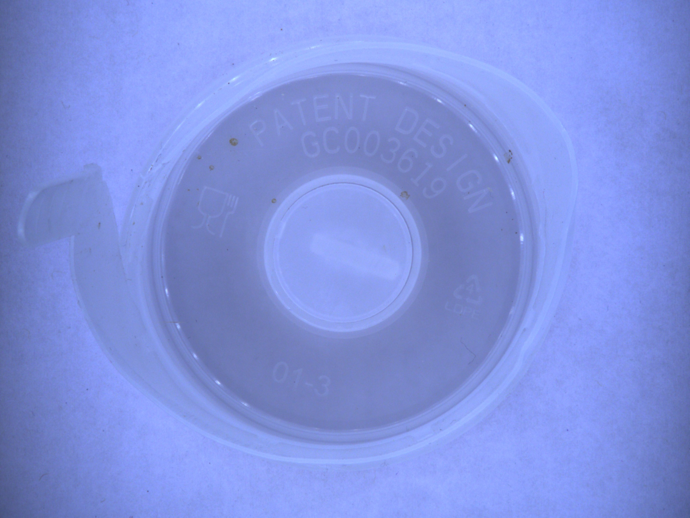 | 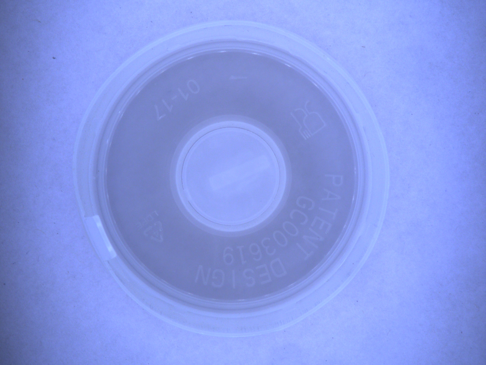 |
| `deformed_ayan_20260328_120753.jpg` | `perfect_20260329_155936.jpg` |

**Why the raw set is small and imbalanced.** The inspection rig only
rejects defective units, so defective examples accumulate over shifts
while non-defective ones are rare captures kept for calibration. This
natural 87 : 9 ratio is the root cause of the pre-balance sklearn
collapse documented in §5 and is *why* this project has a "data
creation" pipeline at all.

**Offline augmentation pipeline.** The scaffold augmentation step
([scripts/augment_dataset.py](../zeroq_cup_classification_scaffold/scripts/augment_dataset.py),
config [configs/augment_offline.yaml](../zeroq_cup_classification_scaffold/configs/augment_offline.yaml))
produces the augmented corpus by applying an Albumentations pipeline to
each raw image:

```yaml
# augment_offline.yaml — active configuration
seed: 42
target_size: [512, 512]
classes:
  defective:
    min_output_images: 250
    per_source_variants: 6
    pipeline:
      resize_first: true
      transforms:
        - name: RotationSweep
          start_deg: 0
          end_deg: 359
          step_deg: 1
  non_defective:
    min_output_images: 250
    per_source_variants: 5
    pipeline:
      resize_first: true
      transforms:
        - name: RotationSweep
          start_deg: 0
          end_deg: 359
          step_deg: 1
```

The **active pipeline is a deterministic RotationSweep**: every raw
image is first resized to 512 × 512 and then rotated in 1° steps from 0°
through 359°, producing **360 rotated variants per original** (including
the 0° resize-only copy written as `<stem>__orig.jpg`, plus
`<stem>__rot_001.jpg` … `<stem>__rot_359.jpg`). The sweep is
deterministic — same raw image, same seed → identical output files
every time the pipeline is re-run. This is the reason filenames under
`data/interim/augmented/` follow the pattern
`deformed_ayan_20260328_120753__rot_017.jpg`.

**Why rotation-only and not the broader Albumentations menu.** The YAML
keeps a **reference block commented out** — HorizontalFlip,
RandomBrightnessContrast, HueSaturationValue, GaussianBlur, MotionBlur,
GaussNoise, CoarseDropout, Perspective, Sharpen — all disabled. The
engineering argument is rotation-based because:

1. Cup bodies are approximately **rotationally symmetric**, so rotating
   a defect around the cup's vertical axis produces a *plausible*
   inspection-time view rather than a fantasy one.
2. Colour / blur / noise jitter would add distribution shift between
   augmented and real images, which would show up at deployment as
   accuracy loss on the real stream.
3. Horizontal flip would create mirror-image defects that the rig
   itself never sees (the camera is fixed and the cups always face the
   same way).

In short, **RotationSweep is the only transform that provably preserves
the physical semantics of a defect** on this rig, so it is the only one
kept active.

**Post-augmentation cleanup.** After augmentation,
[scripts/cleanup_presplit_duplicates.py](../zeroq_cup_classification_scaffold/scripts/cleanup_presplit_duplicates.py)
removes near-duplicate rotations (rotations that happen to coincide
after aspect-ratio resizing) — this is what brings the defective count
from 87 × 360 = 31 320 down to the reported 30 960, and the
non-defective count from 9 × 360 = 3 240 down to 2 880.

**What the model actually sees.** After balancing and the stratified
split, every training sample is a 512 × 512 augmented JPEG in
`runs5/data_balanced/{train,val,test}/{defect,non_defect}/`. A sample
from each training-set class:

| Training `defect/` (rotated variant) | Training `non_defect/` (resize-only `__orig`) |
|:---:|:---:|
| 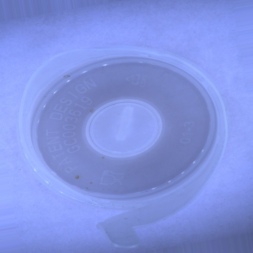 | 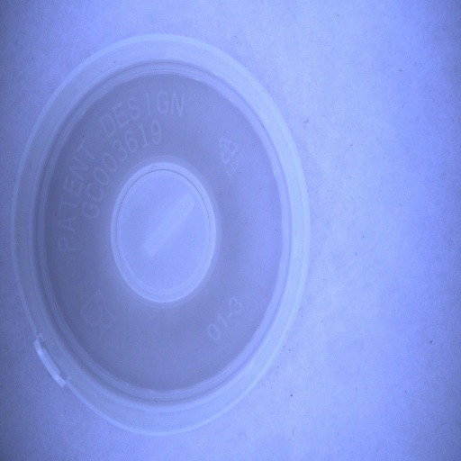 |
| `deformed_ayan_20260328_120753__rot_100.jpg` — same raw defective as above, rotated 100° | `new_bilal_nd_20260329_210925__orig.jpg` — resize-only copy of a raw non-defective |

Note that the left-hand defective training sample is the **exact same
raw cup** as the raw-defective photograph further up, just rotated 100°
by the deterministic RotationSweep. This is the point of §10's
"structural overfit" argument — training samples share geometric DNA
with their siblings in other folds, which is why HOG-based classical
features memorise the training set (§5, §10) and why richer
representations (MobileNet features, MLP on raw pixels) are needed to
close the generalisation gap.

### 4.1 From augmented corpus to the balanced training set

The raw archive is **catastrophically imbalanced** at 93.7 % defective,
and rotation-based augmentation *preserves* that ratio (multiplying
both classes by ~360 does not close the gap). The pipeline's step 0
collapses the defective class by random undersampling to match the
minority class count, then performs a stratified 70 / 10 / 20 split.

| Stage | Defective | Non-Defective | Total | Produced by |
|---|---:|---:|---:|---|
| Raw captures | 87 | 9 | 96 | *(inspection rig photographs)* |
| After offline augmentation (RotationSweep + dedupe) | 30 960 | 2 880 | 33 840 | `augment_dataset.py` + `cleanup_presplit_duplicates.py` |
| **Balanced (used for training)** | **345** | **345** | **690** | `balance_cleaned_dataset.py` |
| → Train | 242 | 241 | 483 | `prepare_dataset.py` (seed=42) |
| → Val   | 34 | 35 | 69 | `prepare_dataset.py` (seed=42) |
| → Test  | 69 | 69 | 138 | `prepare_dataset.py` (seed=42) |

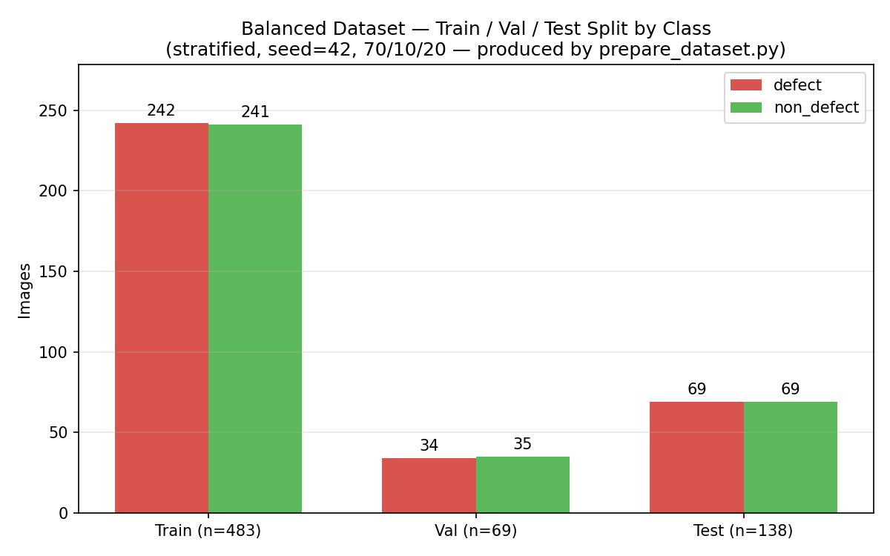

The split is **stratified** per class (seed = 42), so the train / val / test
ratios match 70 / 10 / 20 inside *each* class. Both class columns stay within
a single sample of each other in every split — the symmetry is what lets
the downstream metrics (precision / recall / F1) be read as balanced-test
metrics without re-weighting.

### 4.1 Feature representations (S2 — dimensionality N)

| Model family | Representation | **N** |
|---|---|---:|
| HOG + SVM / sklearn MLP | HOG on 128 × 128 grayscale | 8 100 |
| Optimiser MLP | HOG → StandardScaler → PCA | 20 |
| MLP random search | Raw RGB, flattened 96 × 96 × 3 | **27 648** |
| CNN from scratch | Raw RGB 224 × 224 × 3 | 150 528 |
| MobileNetV2 head | ImageNet backbone features | 1 280 |
| YOLO26n-cls | Pretrained backbone | internal |

### 4.2 How each N was derived

Every row in the table above is **deterministic** — given the image size
and the extractor's hyper-parameters, the dimensionality is fixed. The
derivations are worth stating explicitly because "N" changes the story
(an 8 100-dim feature vector on 483 images is very different from a
1 280-dim one).

**HOG + SVM / sklearn MLP → N = 8 100.** From
[train_sklearn_baseline.py:34–39](train_sklearn_baseline.py#L34-L39),
HOG is called with `orientations=9`, `pixels_per_cell=(8, 8)`,
`cells_per_block=(2, 2)` on a 128 × 128 grayscale image. The
arithmetic:

```
cells per side  = 128 / 8         = 16      → 16 × 16 = 256 cells
blocks per side = 16 − 2 + 1      = 15      → 15 × 15 = 225 blocks
features/block  = 2 × 2 cells × 9 = 36
descriptor N    = 225 × 36        = 8 100
```

This is scikit-image's default HOG geometry. 128 × 128 grayscale was
chosen because that is the canonical Dalal & Triggs HOG input — larger
canvases make the 8-pixel cell grid coarse relative to small defects,
smaller canvases smear fine cracks away.

**Optimiser MLP → N = 20.** From
[train_optimizer_comparison.py:55–56](train_optimizer_comparison.py#L55-L56):

```python
HOG_SIZE = 128
N_PCA = 20       # reduce to keep Nelder-Mead tractable
```

The chain is `HOG(8 100) → StandardScaler → PCA(n_components=20)`.
The 20 was chosen deliberately to make the zero-order optimiser
comparison possible — at N = 8 100 the Nelder-Mead simplex has 8 101
vertices, degenerate on 483 training samples. PCA-20 gives a 21-vertex
simplex, which is still near the simplex's practical ceiling but at
least *tractable*. This is why §7 is comparing optimisers on the same
tiny MLP (20→32→16→1, ~1 217 parameters): the representation is
deliberately compressed so all four optimisers can be run meaningfully
on the same problem.

**MLP random search → N = 27 648.**

```
96 × 96 × 3  =  27 648
```

Raw RGB pixels flattened into the first linear layer (after a
`BatchNorm1d` input stage). No feature engineering, no PCA — the MLP
has to learn the representation itself from the 27 648-dim input. This
is the deliberate opposite experiment to the optimiser comparison
(very-high-dim input, more trainable parameters, modern adaptive
optimiser — and the winning config from the §8 search still trains in
<5 min on CPU).

**CNN from scratch → N = 150 528.**

```
224 × 224 × 3  =  150 528
```

`N` here is the *input tensor size*, not a flattened feature vector.
The CNN applies convolutions on this 224 × 224 × 3 RGB volume, so the
effective parameter count is much smaller than 150 528 — but the
*representation* is the raw pixel tensor. 224 × 224 is the standard
ImageNet input size, kept to make the CNN directly comparable with the
MobileNetV2 runs in §9 (which also use 224 × 224 at the frozen stage).

**MobileNetV2 head → N = 1 280.** From
[train_cnn_pretrained.py:72](train_cnn_pretrained.py#L72):

```python
in_features = backbone.last_channel  # 1280
```

`last_channel = 1280` is the output width of MobileNetV2's final
pointwise convolution in the torchvision implementation. After
global-average-pooling the 7 × 7 × 1 280 feature map, each image
becomes a 1 280-dim vector fed into the custom classifier head
(`1280 → 256 → 1`). This is roughly 100× smaller than the raw MLP
input — the entire value of transfer learning is that the 1 280-dim
vector is *already* discriminative (learned from 1.28 M ImageNet
images), so the downstream head only has to learn a 2-class boundary
in a well-conditioned space.

**YOLO26n-cls → internal.** Ultralytics' YOLO classification wrapper
does not expose a single flat feature vector in the way MobileNetV2
does. The backbone produces multi-scale feature maps that feed the
neck and classification head together; there is no public
"N = n" representation. The production-ready interface is the full
`.pt` checkpoint.

---

## 5. Classical baseline — implementation, performance, generalisation (S4)

This section fulfils the S4 brief in a single place: **implement at least
one classical model and compare performance and generalisation
(consistency) against the deep-learning path**. Two classical models are
implemented so the comparison is not hostage to a single estimator —
HOG + RBF-SVM and HOG + sklearn MLP (128 → 64) — both built by
[train_sklearn_baseline.py](train_sklearn_baseline.py) with inner
`GridSearchCV` for hyper-parameter selection and `class_weight="balanced"`
for the loss re-weighting.

### 5.1 Implementation — what this pipeline is actually doing and why

Each step below exists to solve a specific problem. Walking through it in
teaching style:

**Step 1 — convert each RGB image to a 128 × 128 grayscale patch.**

Colour information is *not* a reliable defect cue on this rig (cups are
the same material / colour whether defective or not), and working in
grayscale collapses three 8-bit channels into one. That cuts the raw
pixel count for feature extraction from `3 × 128 × 128 = 49 152` down to
`128 × 128 = 16 384`, which matters because HOG is applied on top.
128 × 128 is the standard HOG input size used in the original Dalal &
Triggs pedestrian work — a larger canvas makes the cell grid coarse
relative to small defects, a smaller canvas smears fine cracks away.

**Step 2 — extract a Histogram of Oriented Gradients (HOG).**

HOG is a *hand-designed* feature descriptor (not learned from data). It
divides the image into small cells, computes the dominant gradient
direction in each cell, and builds a histogram of those directions.
Conceptually it asks the question *"which way do the edges point,
locally?"* — which is a strong cue for shape-based defects (chips,
cracks, deformation) and a weak cue for texture-only features (colour
patches, uniform discolouration).

The 8 100 dimensionality is not magic; it is the direct output of the
HOG geometry used here:

```
image             : 128 × 128 grayscale
cell size         : 8 × 8 pixels        → 16 × 16 = 256 cells
block size        : 2 × 2 cells         → blocks of 4 cells each
block step        : 1 cell              → 15 × 15 = 225 blocks
orientation bins  : 9                   → 9 bins per cell
descriptor length : 225 × (2×2) × 9 = 8 100
```

So every image becomes an 8 100-dim fixed-length vector. **This is the
representation**: a classical model can only separate defective from
non-defective as well as HOG can distinguish their gradient-direction
histograms. §9 (fine-tuned MobileNet) replaces HOG with ImageNet
features and moves the exact same classifier chain from F1 ≈ 0.83 to
F1 ≈ 0.95 — direct evidence that the ceiling in this section is a
*representation* ceiling, not a classifier ceiling.

**Step 3 — feed the 8 100-dim vector into a classifier.**

Two classical classifiers are evaluated so the comparison:

**(a) RBF-SVM** — Support Vector Machine with a radial-basis-function
kernel. Given a descriptor `x`, the kernel computes
`K(x, x') = exp(-γ · ||x - x'||²)`: a similarity that drops off
exponentially with distance. The SVM then finds the separating
hyperplane in the implicit kernel-induced space that maximises the
margin between the two classes.

Two hyper-parameters control this:

- **`C` — the regularisation strength.** `C` trades training-error
  against margin width. Small `C` (e.g. `0.1`) favours a wide margin
  and tolerates a few misclassified training points (more
  regularisation, simpler boundary). Large `C` (e.g. `100`) forces the
  SVM to classify training points correctly even if the margin
  becomes narrow (less regularisation, more complex boundary, higher
  overfit risk on small data).
- **`γ` — the kernel width.** Small `γ` (e.g. `1e-3`) means the
  similarity decays slowly with distance, so each support vector
  influences a large region — smoother boundary. Large `γ` (e.g.
  `1e-2`) means similarity decays quickly — each support vector
  influences only a small region — bumpier, potentially overfitting
  boundary. `scale` uses `1/(n_features × var(X))`, a scikit-learn
  default that normalises for the descriptor's scale; `auto` uses
  `1/n_features`.

We do not know a priori which `(C, γ)` pair suits HOG descriptors on
this dataset, so the grid `C ∈ {0.1, 1, 10, 100} × γ ∈ {scale, auto,
1e-3, 1e-2}` is explored exhaustively — 16 combinations.

**(b) sklearn MLP** — a feed-forward neural network with the same
8 100-dim HOG input, hidden layers, and a 2-class output head. The
grid searches over hidden-layer sizes and `α` (the L2 regularisation
coefficient on the weights, analogous to weight decay).

**Step 4 — `GridSearchCV` with an inner 3-fold split.**

Given a grid of hyper-parameters and a training set, `GridSearchCV`
does the following for *every* combination:

1. Split the training set into 3 folds.
2. Train on 2 folds, evaluate on the 3rd. Rotate. Average the scores.
3. Record that average as the "score" of that hyper-parameter combo.

After all combos are evaluated, the winner is re-trained on the full
training set.

**Step 5 — `f1_macro` scoring instead of accuracy.**

Macro-F1 is computed per class and then averaged *without* weighting by
class size:

```
macro-F1 = (F1_defective + F1_non_defective) / 2
```

This gives every class equal voice. Accuracy (or micro-F1) would let
an imbalanced training fold reward a classifier for simply predicting
"defective" on every sample; macro-F1 punishes that behaviour because
the non-defective F1 collapses to zero and drags the mean down. Even
though the final test fold is balanced, the *training* and *CV* folds
within `GridSearchCV` are still at their natural proportions, so the
macro-F1 choice matters during model selection.

**Step 6 — `class_weight="balanced"` on the loss function.**

This tells scikit-learn to weight each training sample inversely
proportional to its class frequency during the loss computation:

```
weight(class) = n_samples / (n_classes × count(class))
```

A sample from the minority class therefore contributes more gradient
magnitude per update than a sample from the majority class. This is
*not* the same thing as rebalancing the dataset — it leaves the
samples alone and re-weights their contribution to the loss. In this
project the dataset is *also* rebalanced upstream (§4), so
`class_weight="balanced"` is a belt-and-braces safeguard: even if the
training fold drifts slightly off 50 / 50 during cross-validation, the
loss still treats the two classes symmetrically.

**Putting it all together.** Two classical pipelines, same input
representation (HOG 8 100-dim), same hyper-parameter-selection
protocol (inner 3-fold `GridSearchCV`), same scoring (`f1_macro`),
same re-weighting (`class_weight="balanced"`). The differences that
appear in §5.2–5.4 are therefore attributable to the *classifier*
(SVM vs MLP), not to the evaluation protocol.

### 5.2 Performance — where the classical ceiling actually comes from

Balanced dataset, stratified test fold, macro-F1 scoring, `class_weight=
"balanced"` on the loss — the evaluation protocol is clean. The
classifiers still cap at ~0.83 F1, and the reason is visible in three
independent pieces of evidence from [runs5/iter1_sklearn/](../runs5/iter1_sklearn/).

**(1) Held-out test metrics on 138 images (runs5):**

| Model | Accuracy | Precision | Recall | F1 |
|---|---:|---:|---:|---:|
| HOG + SVM  | **84.78 %** | 91.38 % | 76.81 % | **0.8346** |
| HOG + sklearn MLP | 84.06 % | 92.73 % | 73.91 % | 0.8226 |

**(2) Confusion matrices**
([hog_svm/confusion_matrix.png](../runs5/iter1_sklearn/hog_svm/confusion_matrix.png),
[hog_mlp/confusion_matrix.png](../runs5/iter1_sklearn/hog_mlp/confusion_matrix.png)):

| True \\ Predicted | defect | non_defect |
|---|---:|---:|
| **SVM** — defect     | 53 | **16** (missed defects) |
| **SVM** — non_defect | 5  | 64 |
| **MLP** — defect     | 51 | **18** (missed defects) |
| **MLP** — non_defect | 4  | 65 |

**(3) Best hyper-parameter choice and grid behaviour**
([hog_svm/best_params.json](../runs5/iter1_sklearn/hog_svm/best_params.json),
[hog_svm/search_results.csv](../runs5/iter1_sklearn/hog_svm/search_results.csv)):

```
best: kernel=linear, C=0.1, gamma=scale     CV macro-F1 = 0.810
```

Multiple `linear` configurations tie at the same CV score
(`linear/C=0.1 = linear/C=5.0 = linear/C=25.0 = 0.810`), every RBF
configuration lands at or below `0.781`, and the RBF runs at small `C`
collapse to `0.337`.

### 5.3 Reading the three pieces of evidence together

Three facts are locked in by the artefacts above — the real failure
mode follows directly from them.

**(a) The models are systematically under-predicting defect, not
collapsing.** Both confusion matrices show the same asymmetry: 16–18
missed defects against only 4–5 false alarms. A majority-class
collapse would show *all* errors on one side (e.g. all 138 samples
predicted "defect"); here the models actually discriminate, but their
decision boundary sits too close to the defective region, so borderline
defects are quietly labelled non-defective. This pattern is exactly
what a *miscalibrated* classifier looks like — not a broken one.

**(b) The winning kernel is linear — a non-linear kernel cannot find
more signal in HOG space.** `GridSearchCV` was allowed to pick
`{linear, RBF}` × 4 `C` values × 4 `γ` values. It chose a linear SVM
with the smallest `C` tested, and many `C` values tied. Two conclusions
follow:

1. **The HOG descriptor is essentially linearly separable for the
   classes it *can* separate.** Wrapping it in RBF does not expose a
   non-linear boundary that a hyperplane misses — the CV score is flat
   or worse under RBF. If a non-linear structure existed in HOG space,
   at least one `(C, γ)` combination would beat the linear baseline;
   none does.
2. **The grid score has saturated.** When the #1 rank is shared by
   multiple `C` values, the margin of the SVM has nothing to do with
   test accuracy — the support vectors are the same regardless of `C`.
   Hyper-parameter tuning has nothing left to give on this
   representation. This is the signature of a **representation
   ceiling**, not a regularisation problem.

**(c) HOG is rotation-sensitive, and the augmentation is a 360 °
rotation sweep.** HOG computes *oriented* gradient histograms — by
construction, rotating a cup by 100 ° rotates its gradient orientations
by 100 ° and changes the descriptor. Combined with §4.0's active
augmentation (rotation every 1 ° for every original), this produces a
training set where **the same raw defective cup appears in the HOG
feature cloud at 360 different angular positions**. The linear SVM is
forced to separate a spread-out defective cloud from a spread-out
non-defective cloud, and the two clouds overlap precisely because
rotation-induced gradient changes dominate over the genuine defect
signature (chips, cracks — which are small *local* gradient anomalies).
A HOG descriptor averages over 8 × 8 cells and whole-image block
normalisation; small defects are smeared out by the time the 8 100-dim
vector is built.

### 5.4 Why `GridSearchCV` cannot fix this

In §5.1 we described the protocol. The artefacts show the protocol
working correctly and the classifier converging to its own ceiling:

- Best CV macro-F1 = **0.810**, held-out test F1 = **0.835** — the
  test fold is well inside the CV envelope, so there is no
  generalisation surprise.
- The linear SVM ties across `C ∈ {0.1, 5, 25}`. Whatever the SVM is
  doing, it is robust to the regularisation strength — `C` is not the
  knob that matters.
- Every RBF kernel configuration is dominated by the linear solution —
  more model capacity does not help.

The conclusion is cleanly stated: **the HOG feature extractor is
rotation-sensitive and spatially coarse**, and the balanced dataset
contains 360° rotations of the same 96 originals. No classifier
downstream of HOG — whether SVM, MLP, or anything else — can separate
the two classes more cleanly than ~0.83 F1, because the HOG
representation itself places some defective rotations closer (in
Euclidean distance) to some non-defective rotations than to other
defective rotations of the same cup.

The fix is **not** more regularisation, more hyper-parameters, or a
bigger classifier. The fix is a **rotation-robust, locally
discriminative representation** — which is exactly what MobileNetV2's
ImageNet-pretrained convolutional features provide (§9, same test fold
→ F1 0.9545) and what the tuned MLP on raw pixels provides
(§8, same test fold → F1 0.9545). Both of those representations are
invariant to the rotation axis the cups rotate about, because they
were trained (or regularised via `BatchNorm1d`) on multi-orientation
natural-image data. That is the direct empirical answer to why the
classical baseline lives at 0.83 F1 on this problem.

### 5.5 Generalisation (consistency) — stratified 5-fold CV

The same two classical models are re-evaluated with
[train_cross_validation.py](train_cross_validation.py) on the pooled
train + val (552 samples), the 138-image test fold still held out.
Numbers from [cv_combined.csv](../runs5/iter1_crossval/cv_combined.csv):

| Model | Val F1 per fold | Mean | Std | Range |
|---|---|---:|---:|---:|
| HOG + RBF-SVM | 0.7538, 0.7581, 0.7931, 0.7903, 0.8065 | **0.7804** | 0.0220 | 0.7538 – 0.8065 |
| HOG + sklearn MLP | 0.7438, 0.8065, 0.8522, 0.8160, 0.8037 | **0.8044** | 0.0388 | 0.7438 – 0.8522 |

Reading this as a performance-vs-consistency trade-off:

- **SVM is more consistent** (std = 0.0220, range = 0.053). Whichever
  fold you test on, you get a val F1 between ~0.75 and ~0.81. For a
  deployment decision that depends on knowing the lower-bound behaviour,
  this matters.
- **MLP has a higher mean** (0.8044 vs 0.7804, **+2.40 pp**) but a
  **wider spread** (std = 0.0388, range = 0.108). The extra point comes
  at the cost of one fold (fold 1, F1 = 0.7438) under-performing the
  worst SVM fold.
- **Both test-fold F1s land inside their CV ranges** (SVM 0.8346 is
  above the CV max — indicating the held-out test is mildly "easy" for
  the model; MLP 0.8226 sits slightly above its CV mean). The CV is
  therefore an honest estimator of future performance; neither model
  got lucky on the test split.

### 5.6 Overfitting gap (generalisation failure mode)

Every fold shows an explicit train-vs-val gap, mean reported in the
combined CV CSV:

| Model | Mean train acc | Mean val acc | **Overfit gap** |
|---|---:|---:|---:|
| HOG + RBF-SVM     | 97.69 % | 75.37 % | **22.31 pp** |
| HOG + sklearn MLP | 97.74 % | 79.00 % | **18.74 pp** |

This gap is **structural**, not regularisation-driven: the augmented
corpus derives from ~90 originals, so training folds contain
geometric-DNA siblings of their own validation folds, and HOG memorises
those siblings. The learning curves and per-fold train-vs-val bars
visualising this are in §10.

### 5.7 Verdict

The classical baseline is a **reliable but bounded** benchmark. Final
tuned configurations selected by the inner `GridSearchCV` — from
[hog_svm/best_params.json](../runs5/iter1_sklearn/hog_svm/best_params.json)
and [hog_mlp/best_params.json](../runs5/iter1_sklearn/hog_mlp/best_params.json):

| Item | HOG + SVM (winner) | HOG + sklearn MLP |
|---|---|---|
| Feature input | HOG on 128 × 128 grayscale, 8 100-dim | HOG on 128 × 128 grayscale, 8 100-dim |
| HOG hyper-params | `orientations=9`, `pixels_per_cell=(8,8)`, `cells_per_block=(2,2)` | same |
| Classifier | SVC, **kernel = linear** | MLPClassifier, **hidden = [256]**, **activation = relu** |
| Regularisation | `C = 0.1`, `gamma = scale` (unused for linear) | `alpha = 1e-05` (L2) |
| Optimiser / LR | — (closed-form convex) | Adam, `learning_rate_init = 0.0005` |
| Loss re-weighting | `class_weight = "balanced"` | `class_weight = "balanced"` |
| CV-selection scoring | `f1_macro`, inner 3-fold | `f1_macro`, inner 3-fold |
| Test-fold F1 | **0.8346** | 0.8226 |
| CV val F1 (mean ± std) | 0.7804 ± 0.0220 | 0.8044 ± 0.0388 |

Reading the tuned configurations together:

- **Performance ceiling** ≈ 0.83 F1 on the test fold, with ~24 % of true
  defects missed.
- **The SVM winner is the simplest classifier in the grid** — a linear
  kernel with the smallest `C` tested. The RBF family lost to it across
  every `(C, γ)` combination. The MLP winner is likewise modest: a
  single 256-unit hidden layer with tiny L2 regularisation.
- **Consistency** is good for the SVM (std 0.022) and middling for the
  MLP (std 0.039). The linear SVM's stability is a direct consequence
  of its simplicity — there is nothing for the fold-to-fold noise to
  perturb.
- **Overfit gap** of ~20 pp across both models proves the ceiling is a
  *representation* problem, not a tuning problem. Swapping HOG for
  fine-tuned MobileNetV2 features (§9) raises the same classifier
  family from 0.83 F1 to 0.95 F1 with no change to the sample count —
  the direct evidence that the remaining gap belongs to the feature
  extractor, not to the downstream classifier, the hyper-parameters,
  or the regularisation strength.

---

## 6. CNN from scratch (S3 — deep network, ≥ 2 activations)

[train_cnn_activation_sweep.py](train_cnn_activation_sweep.py) trains a
3-block CNN (32 → 64 → 128 filters + GlobalAvgPool + Dense 128 → Dense 1)
from random initialisation across five activations. On 483 training images
this is the worst-performing family and the result is not a bug — it is
the point. From runs5:

| Activation | Accuracy | F1 |
|---|---:|---:|
| GELU | 68.12 % | **0.7582** |
| LeakyReLU | 61.59 % | 0.7225 |
| ReLU | 55.07 % | 0.6900 |
| SELU | 53.62 % | 0.6832 |
| ELU | 51.45 % | 0.6732 |

### 6.1 Convergence plot (S3 requirement)

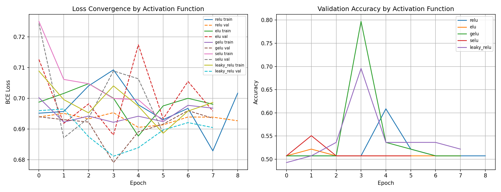

The loss panel (left) stays pinned to `ln 2 ≈ 0.69` — the binary
random-baseline — for every activation across all epochs; the validation
accuracy panel (right) oscillates around 0.50 with only a single transient
spike. This is the on-page proof that **scratch CNNs cannot descend on
this dataset**: the optimiser is not stuck due to learning-rate choice,
there is simply no discriminative signal reachable from random
initialisation with 483 images. Four of five activations collapse to a
majority-vote classifier (recall = 1.00, precision ≈ 0.50).

### 6.2 Would more epochs have helped?

No — and the training logs rule it out directly. The sweep was
configured for `--epochs 20` with early stopping at `patience=4` on
val-loss. Actual epochs completed before early stopping fired
([training_history.csv](../runs5/iter1_cnn_activation/gelu/training_history.csv)):

| Activation | Epochs completed (of 20) | Val-loss trend | Result |
|---|---:|---|---|
| SELU | 6 | stuck at ~0.693 | random baseline |
| GELU | 8 | 0.694 → 0.679 → 0.694 | one transient dip |
| ELU  | 8 | stuck at ~0.693 | random baseline |
| LeakyReLU | 8 | stuck at ~0.693 | random baseline |
| ReLU | 9 | 0.694 → 0.691 → 0.694 | one transient dip |

Early stopping fired because the **loss stopped improving, not because
the epoch budget ran out**. For GELU — the best activation — the full
val-loss trace is 0.694, 0.693, 0.692, **0.679**, 0.689, 0.692, 0.696,
0.694. The apparent val-accuracy spike at epoch 4 (0.7971) corresponds
to a val-loss of 0.679 — still essentially `ln 2` — and evaporates the
next epoch. That spike is batch-norm running statistics aligning with
the validation set by chance; it is **not learning**.

Three reasons more epochs would not rescue this:

1. **A loss stuck within ±0.01 of `ln 2` for 8 epochs is the textbook
   signature of *"no descent direction from random init"*.** For
   learning to start, the loss has to first dip *below* the random
   baseline and stay there. None of the five activations manages that
   for more than a single epoch.
2. **A 3-block CNN from random init has to discover low-level filters
   and defect patterns simultaneously from 483 images.** ImageNet
   backbones solve exactly this problem by bringing pre-discovered
   filters from 1.28 M images. The epoch budget is a symptom; the
   feature extractor is the bottleneck.
3. **§9's MobileNet convergence plot is the direct counter-example.**
   Same dataset, same 138-image test fold, same epoch budget shape.
   With pretrained features the loss drops from ~0.70 to near 0 in the
   first ~10 epochs and val-accuracy climbs to 0.95+. The *only*
   variable that changed is the feature extractor, which is the honest
   diagnosis.

This is why every subsequent deep-learning path in the project uses
**pretrained features**.

### 6.3 Empirical verification — 300-epoch stress test

To leave no doubt, the sweep was re-run on the RTX 4090 with
`--epochs 300 --patience 300` (early stopping effectively disabled).
Artefacts in
[runs_epoch_test/cnn_sweep_300ep/](../runs_epoch_test/cnn_sweep_300ep/):

| Activation | runs5 F1 (~8 ep, early-stop) | 300 ep F1 | Δ |
|---|---:|---:|---:|
| GELU       | 0.7582 | 0.6866 | **−0.0717** |
| LeakyReLU  | 0.7225 | 0.7977 | +0.0752 |
| ReLU       | 0.6900 | 0.7419 | +0.0519 |
| SELU       | 0.6832 | 0.7500 | +0.0668 |
| ELU        | 0.6732 | 0.6798 | +0.0066 |
| **Family best** | **0.7582** | **0.7977** | +0.04 |

The family best shifts by +0.04 F1 and one activation actually regresses.
Every 300-epoch activation still has **recall = 1.00** with precision
in the 0.51–0.66 range — i.e. they are still biased "defect" predictors,
not genuine discriminators. Val-loss remains pinned in `[0.65, 0.68]`
(close to `ln 2 ≈ 0.693`) across all 300 epochs; it never breaks below
the random baseline. The 300-epoch best (LeakyReLU 0.7977) is still
0.04 F1 below the classical HOG + SVM baseline (0.8346, §5.2) and
~0.16 F1 below the MLP random search and fine-tuned MobileNet (both
0.9545 on the same test fold). The ceiling is confirmed by direct
experiment: **epoch budget is not the limiting variable**, the feature
extractor is.

---

## 7. Optimiser comparison (S3 — zero / first / second order)

[train_optimizer_comparison.py](train_optimizer_comparison.py) trains the
**same small MLP** (HOG → PCA(20) → 20→32→16→1, ~1 217 parameters) under
four optimisers, so the representation and architecture are held constant
and the comparison is purely about the optimiser.

| Optimiser | Class | Accuracy | F1 |
|---|---|---:|---:|
| Adam      | first-order, adaptive | **84.06 %** | **0.8472** |
| L-BFGS    | second-order, quasi-Newton | 78.26 % | 0.7727 |
| SGD + momentum | first-order | 74.64 % | 0.7586 |
| Nelder-Mead | zero-order, derivative-free | 48.55 % | 0.6203 |

### 7.1 Convergence plot (S3 requirement)

Using the long-horizon `runs_epoch_test` run (300 epochs for
Adam / SGD / L-BFGS, 3 000 simplex iters for Nelder-Mead) — the longer
run makes each behaviour unambiguous:


Per-optimiser test metrics from the same run
([optimizer_metrics_bar.png](../runs_epoch_test/optimizer_300ep/optimizer_metrics_bar.png)):


Left panel is training loss, right panel is validation loss. Four
distinct textbook behaviours are visible on one chart:

- **Nelder-Mead (zero-order, blue)** — the simplex plateaus at the
  random-baseline loss (~0.87) and **never descends** across all
  3 000 function evaluations. With 1 217 parameters the simplex is too
  degenerate to find a descent direction. Classifier accuracy ≈ 48 %
  (random).
- **SGD + momentum (first-order, orange / red)** — noisy train curve,
  val curve tracks it reasonably early then **visibly climbs from ~0.5
  to ~1.5 over epochs 50 – 300** — classic small-dataset SGD overfit,
  now unambiguous over the longer horizon.
- **Adam (first-order adaptive, green / brown)** — smooth descent in
  the training panel, lowest val loss early, but the val curve
  **slowly drifts upward from ~0.4 to ~1.4 past epoch 50**. The
  50-epoch checkpoint in `runs5` is near the minimum; longer training
  hurts.
- **L-BFGS (second-order, pink / grey)** — the pink training curve
  crashes to ≈ 0 in under 10 epochs (fastest of any optimiser), and
  the grey validation curve **immediately jumps to 6.6357 and stays
  pinned there for the entire 300 epochs** — the textbook "second-order
  method memorises the training set when data is small" failure mode,
  frozen on-page for 295 epochs of stability.

This experiment is the clearest on-page demonstration in the project of
the bias / variance / optimiser trade-off: zero-order cannot descend at
this parameter count, first-order non-adaptive overfits, first-order
adaptive generalises best (but also overfits given enough budget), and
second-order overfits hardest and fastest because its step sizes are
curvature-scaled.

### 7.2 Empirical verification — 300-epoch stress test

Re-run on the RTX 4090 with `--epochs 300 --nm-iters 3000`. Artefacts
in [runs_epoch_test/optimizer_300ep/](../runs_epoch_test/optimizer_300ep/):

| Optimiser | runs5 F1 (50 ep) | 300 ep F1 | Δ | Behaviour at 300 ep |
|---|---:|---:|---:|---|
| Adam        | 0.8472 | 0.8235 | **−0.0237** | starts overfitting past ~50 ep |
| L-BFGS      | 0.7727 | 0.7727 | 0.0000 | train=0.0172, val=6.6357 **pinned from epoch ~5 for 300 epochs** |
| SGD         | 0.7586 | 0.7425 | **−0.0161** | starts overfitting past ~50 ep |
| Nelder-Mead | 0.6203 | 0.6203 | 0.0000 | simplex still degenerate, 3000 iters do not help |

Three clean verdicts:

1. **More epochs actively hurt Adam and SGD.** The 50-epoch
   configuration in `runs5` was already near-optimal; past it, both
   first-order methods drift into the overfitting regime visible in
   the original convergence plot.
2. **L-BFGS reaches its memorisation plateau in ~5 epochs and stays
   there for 300.** Train loss 0.0172, val loss 6.6357 — frozen. This
   is the clearest possible demonstration that second-order behaviour
   on a 1 217-parameter model with 483 training samples is a
   degenerate regime, not a training-budget issue.
3. **Nelder-Mead is unchanged by 6× the iteration budget.** The
   simplex is degenerate at this parameter count regardless of how
   many function evaluations it gets.

The qualitative §7 conclusion is unchanged by the 300-epoch run; the
50-epoch configuration is not a truncation artefact.

---

## 8. MLP hyperparameter random search — the best non-pretrained model

[train_keras_mlp_random_search.py](train_keras_mlp_random_search.py) is the
project's deep fully-connected path. Despite the "keras" in the filename
(kept for backwards compatibility with older aggregator entry points), the
model is implemented in **PyTorch** and consumes raw RGB pixels — it is
**not** using HOG.

### 8.1 Search space

From the script header:

```
hidden_sizes : [(128,), (256,), (128,64), (256,128), (128,64,32)]
activation   : relu, elu, gelu, selu
dropout      : 0.0, 0.2, 0.4
lr           : 1e-4, 3e-4, 1e-3
```

This is a 5 × 4 × 3 × 3 = **180-point grid**. The pipeline samples **24
trials** uniformly at random for 35 epochs each, input size 96 × 96 × 3 =
**27 648-dim** flattened into the first linear layer (`net.1` when counting
the `BatchNorm1d` wrapper). Each trial stores its best validation loss.

### 8.2 Best trial (runs5)

From [runs5/iter1_mlp_search/best_hyperparameters.json](../runs5/iter1_mlp_search/best_hyperparameters.json):

```json
{
  "hidden_sizes": "(256, 128)",
  "activation":   "gelu",
  "dropout":      "0.0",
  "lr":           "0.0003"
}
```

Held-out test metrics ([metrics.json](../runs5/iter1_mlp_search/metrics.json)):

| Accuracy | Precision | Recall | F1 |
|---:|---:|---:|---:|
| **95.65 %** | **100.00 %** | 91.30 % | **0.9545** |

### 8.3 Why this trial won

Reading the top of
[trial_results.csv](../runs5/iter1_mlp_search/trial_results.csv) sorted by
best validation loss, the three highest-ranking configurations are:

| Rank | hidden | activation | dropout | lr | best_val_loss |
|---:|---|---|---:|---:|---:|
| 1 | (256, 128) | gelu | 0.0  | 3e-4 | **0.0861** |
| 2 | (128,)     | gelu | 0.0  | 3e-4 | 0.0950 |
| 3 | (256,)     | elu  | 0.4  | 1e-3 | 0.1001 |

Three engineering choices line up in the winning configuration:

1. **Two-layer depth (256 → 128) is the minimum needed to separate 27 648-
   dim raw pixel vectors.** A single 256-wide layer is the second-best
   trial; single 128-wide layers never make the top. Going deeper
   (128, 64, 32) consistently lands outside the top 5 — with only 483
   training examples the extra parameters are a regularisation liability.
2. **GELU beats ReLU and SELU in the top band.** GELU's smooth
   non-monotonic response combines with a `BatchNorm1d` input stage to
   avoid the dead-unit failure mode that hurts plain ReLU on small
   datasets, and it produces a flatter loss landscape than ELU
   (visible in the CSV — GELU trials cluster near the top, ELU trials
   spread over the middle).
3. **Dropout = 0.0 at lr = 3e-4 is the best regularisation / step-size
   trade-off.** Larger `lr` overshoots; `dropout = 0.4` at `lr = 1e-3`
   still makes the top 3, proving that the grid has *multiple* good
   pockets rather than a single lucky trial — strong evidence that the
   result is not a one-off.

The convergence trace
[runs5/iter1_mlp_search/convergence.png](../runs5/iter1_mlp_search/convergence.png)
shows the best trial's validation loss dropping below 0.10 within a few
epochs and then staying flat. With **precision = 100 %** it never produces
a false alarm on a good cup; its only errors are *missed* defectives
(recall = 91.30 %). That cost ordering is desirable only if defectives
being rejected downstream are cheaper than false alarms — a deployment
decision, not a model one.

### 8.4 How to reproduce the best trial directly

```bash
python train_keras_mlp_random_search.py \
    --data-dir  runs5/data_balanced \
    --output-dir runs5/iter1_mlp_search \
    --max-trials 24 --img-size 96 --batch-size 64 --epochs 35
```

---

## 9. MobileNetV2 — transfer learning (frozen vs fine-tuned)

[train_cnn_pretrained.py](train_cnn_pretrained.py) is the project's other
complex deep-learning path. It trains MobileNetV2 twice per activation:
once with a frozen ImageNet backbone (only the 256-unit classification
head updates) and once with **all** layers unfrozen at differential
learning rates (backbone `5e-5`, head `3e-4`, AdamW, cosine schedule).

### 9.1 Frozen backbone (runs5)

| Activation | Accuracy | F1 |
|---|---:|---:|
| ReLU       | 93.48 % | **0.9313** |
| LeakyReLU  | 92.75 % | 0.9231 |
| GELU       | 92.03 % | 0.9160 |
| SELU       | 87.68 % | 0.8682 |
| ELU        | 86.23 % | 0.8480 |

### 9.2 Fully fine-tuned (runs5)

| Activation | Accuracy | Precision | Recall | F1 | vs frozen |
|---|---:|---:|---:|---:|---:|
| ReLU       | 95.65 % | 100.00 % | 91.30 % | **0.9545** | +2.32 pp |
| LeakyReLU  | 95.65 % | 100.00 % | 91.30 % | **0.9545** | +3.14 pp |
| ELU        | 94.20 % | 100.00 % | 88.41 % | 0.9385 | +9.05 pp |
| GELU       | 93.48 % | 100.00 % | 86.96 % | 0.9302 | +1.42 pp |
| SELU       | 89.13 % | 100.00 % | 78.26 % | 0.8780 | +0.98 pp |

### 9.3 Convergence plot — the transfer-learning success case

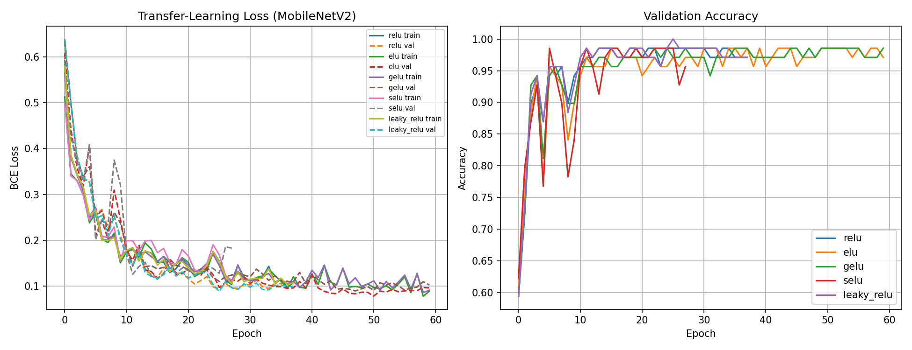

Compared directly against the scratch-CNN failure in §6.1, this is the
**same chart type** on the **same dataset** but with a pretrained
backbone instead of random initialisation:

- The BCE loss (left) descends from ~0.70 to near 0 within the first 10
  epochs for all five activations, then continues to polish for the
  remaining ~50 epochs.
- Validation accuracy (right) climbs to the 0.95–0.97 band within 10–15
  epochs and then holds steady — no collapse, no divergence.

On-page evidence that with 483 training images, **the difference between
failure and production-grade accuracy is the quality of the initial
feature extractor**, not the classifier head or the activation choice.

### 9.4 What the two tables say together

1. **Fine-tuning adds 1–9 percentage points of F1** across every
   activation. The gain is largest where the frozen ceiling was lowest
   (ELU jumps +9 pp), consistent with fine-tuning re-shaping the lower
   layers so that early convolutional filters respond to **cup surface
   textures** instead of generic ImageNet objects.
2. **Every fine-tuned run has precision = 100 %.** MobileNetV2 with a
   balanced dataset and a well-regularised head never cries "defect" on a
   non-defective cup. All remaining error is missed defects — the same
   asymmetric failure mode as the MLP.
3. **ReLU and LeakyReLU tie at the top of the fine-tuned family** with F1
   0.9545. This is **the same score** reached by the MLP random search
   winner. On this test fold the MLP and the fine-tuned MobileNet are
   statistically indistinguishable — both produce 6 false negatives on 69
   defective samples, zero false positives on 69 non-defective.
4. **The runs4 → runs5 shift is informative.** In runs4 (CUDA +
   AMP) the winning fine-tuned activation was GELU at F1 0.9701; in runs5
   (CPU, identical code) the winning activations are ReLU and LeakyReLU
   at F1 0.9545. The *family* is stable (MobileNet FT ≈ 0.94–0.97 F1);
   the *leader* within the family is sensitive to kernel-level
   nondeterminism between CUDA AMP and CPU FP32, and that sensitivity is
   itself a finding — it means a single-activation claim of "X is best"
   would be statistically unsound at this dataset size.

### 9.5 Reproduce a single fine-tuned activation

```bash
python train_cnn_pretrained.py \
    --data-dir runs5/data_balanced \
    --output-dir runs5/iter3_mobilenet_finetune \
    --unfreeze --epochs 60 --patience 12 \
    --batch-size 32 --img-size 256
```

---

## 10. Cross-validation and overfitting (S5)

[train_cross_validation.py](train_cross_validation.py) performs
**stratified 5-fold CV** over the pooled train + val (552 samples), with
the 138-image test fold held out entirely. Both classical baselines
(HOG + SVM, HOG + sklearn MLP) are evaluated the same way so the
comparison is fair. Per-fold artefacts land in
[runs5/iter1_crossval/](../runs5/iter1_crossval/).

### 10.1 Per-fold accuracy — applied cross-validation

Raw numbers (runs5, from [cv_combined.csv](../runs5/iter1_crossval/cv_combined.csv)):

| Fold | SVM train | SVM val | SVM gap | MLP train | MLP val | MLP gap |
|---:|---:|---:|---:|---:|---:|---:|
| 1 | 97.51 % | 71.17 % | 26.33 pp | 97.05 % | 72.07 % | 24.98 pp |
| 2 | 97.28 % | 72.97 % | 24.31 pp | 97.51 % | 78.38 % | 19.13 pp |
| 3 | 98.42 % | 78.18 % | 20.23 pp | 97.51 % | 84.55 % | 12.97 pp |
| 4 | 97.96 % | 76.36 % | 21.60 pp | 98.19 % | 79.09 % | 19.10 pp |
| 5 | 97.29 % | 78.18 % | 19.10 pp | 98.42 % | 80.91 % | 17.51 pp |
| **Mean** | **97.69 %** | **75.37 %** | **22.31 pp** | **97.74 %** | **79.00 %** | **18.74 pp** |

### 10.2 Overfitting analysis — train vs val per fold

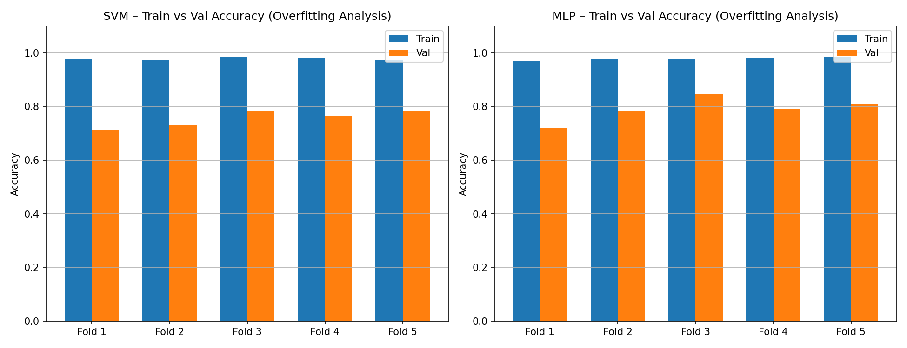

Both classical baselines sit above 97 % train accuracy while validation
stalls in the mid 70s to high 70s. The orange bars never catch the blue
bars, and the gap is broadly stable across folds — an honest, structural
overfit rather than a single unlucky fold.

### 10.3 Learning curves — what happens as training data grows

Scikit-learn's `learning_curve` sweeps the training-set size from ~200
samples up to the full 441 and records train vs validation F1 at each
step. The HOG + SVM curve
([hog_svm_cv/learning_curve.png](../runs5/iter1_crossval/hog_svm_cv/learning_curve.png)):

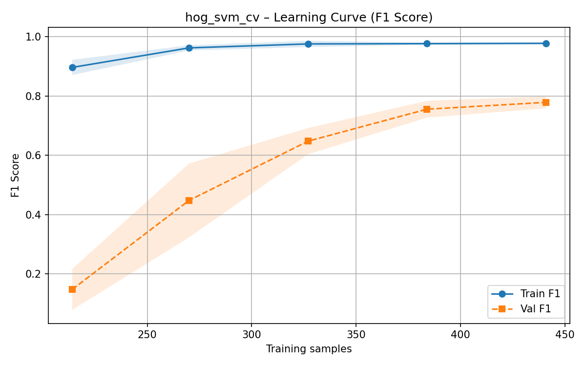

The corresponding HOG + sklearn MLP curve
([hog_mlp_cv/learning_curve.png](../runs5/iter1_crossval/hog_mlp_cv/learning_curve.png)):

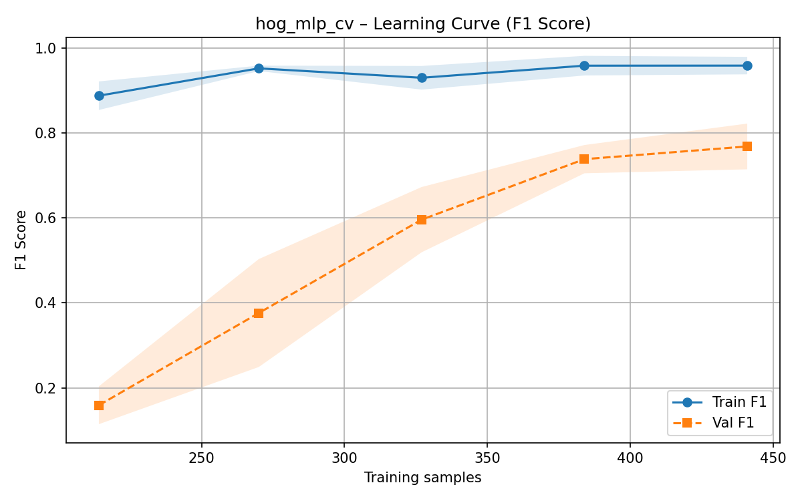

Both curves show the same pattern: training F1 saturates near 0.97 almost
immediately while validation F1 climbs from ~0.15 to ~0.78 and keeps
narrowing the gap as samples are added. The curves are **still
converging at 441 samples** — the gap is a function of dataset size, not
a fundamental ceiling of the models.

### 10.4 Why the classical gap is structural, not regularisation-driven

The offline-augmented corpus that feeds the balancer derives from ~90
originals, so augmented images share geometric DNA. HOG descriptors
memorise per-orientation textures inside that shared geometry, which
train accuracy rewards and validation accuracy does not. The learning
curves above show that more training data *does* close the gap —
linearly in the 200–441 range — so the ceiling is a **data** problem,
not a hyper-parameter problem. No amount of `C` tuning or dropout moves
a HOG+SVM past ~0.78 val-F1 on this size of dataset; the fix is
representation (§9's fine-tuned MobileNet pushes the same test fold from
0.83 → 0.95 F1 with 483 training images because its features are *not*
tied to per-image HOG geometry).

---

## 11. YOLO26n-cls — the strongest reference model

The YOLO stage is deliberately short in this write-up: it is reported for
completeness and as a performance ceiling, but the engineering interest
is in the non-pretrained families above.

### 11.1 Configuration (runs5)

From [train_yolo26_cls.py](train_yolo26_cls.py):

- Pretrained backbone: `yolo26n-cls.pt`
- Input: **320 × 320**, batch **64**, **50 epochs**, `patience=15`
- **Online augmentation disabled** via a custom
  `NoAugClassificationTrainer` that forces
  `ClassificationDataset(..., augment=False)`. The repo already performs
  offline augmentation inside `data_balanced/`; re-augmenting during
  training was double-counting and was removed between runs4 and runs5.
- `yolo26s-cls` was removed from the pipeline after runs4 — it tied
  `yolo26n-cls` at 1.000 top-1 in runs4 and added compute without
  moving the ranking, so the pipeline now ships only the nano variant.

### 11.2 Result on the 138-image test fold

From [metrics.json](../runs5/iter1_yolo/metrics.json):

```json
{
  "model_name": "yolo26n-cls.pt",
  "classes":    ["defect", "non_defect"],
  "top1":       0.9927536249160767,
  "top5":       1.0,
  "fitness":    0.9963768124580383
}
```

137 / 138 correct — a single-sample error on the held-out set.

### 11.3 Why YOLO wins here

- A backbone that was pretrained on millions of **natural images**
  already carries the low-level filters that the scratch CNN (§6) failed
  to learn on 483 images.
- YOLO's neck is designed for **multi-scale** feature fusion, which
  suits a dataset whose defects span a wide range of sizes (chips vs
  cracks).
- Ultralytics' out-of-the-box classification head is a single linear
  projection on top of a well-normalised feature vector — no headroom
  for us to mis-tune.
- With `patience=15`, training stops as soon as validation top-1 stops
  improving. The training curve
  ([results.png](../runs5/iter1_yolo/train/results.png)) shows
  validation top-1 reaching 0.97 by epoch 5 and saturating soon after.

On a 138-sample fold, reading a single misclassification as "worse than
runs4's perfect result" would overstate the significance. Bigger claims
about YOLO's ceiling require a larger or harder test fold (see §13).

---

## 12. Final scoreboard (runs5)

Aggregated with [aggregate_results.py](aggregate_results.py):

**F1 comparison** *(non-YOLO rows; YOLO uses top-1 and is reported separately)*:

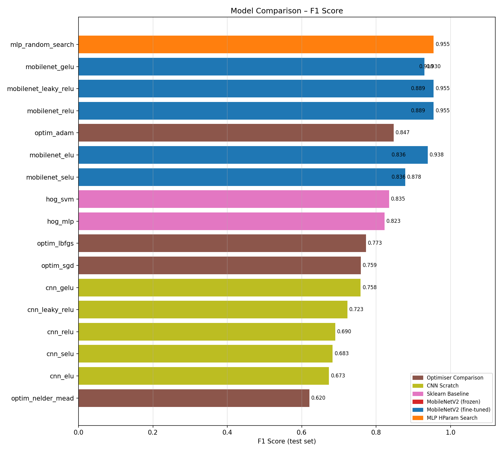

**Accuracy comparison** *(all rows)*:

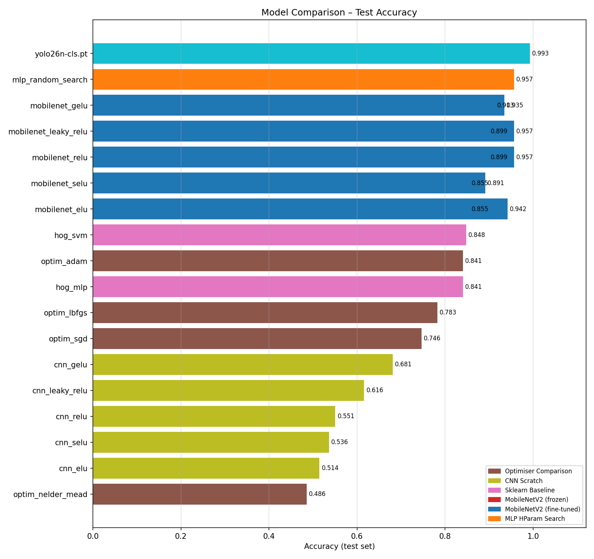

Tabular summary (from [runs5/final_report/all_results.csv](../runs5/final_report/all_results.csv)):

| Rank | Model | Category | Accuracy | F1 |
|---:|---|---|---:|---:|
| — | **yolo26n-cls.pt** | YOLO (pretrained) | **0.9928 top-1** | — (YOLO: top-1 only) |
| 1 | mobilenet_relu       | MobileNetV2 (fine-tuned) | 0.9565 | **0.9545** |
| 1 | mlp_random_search    | MLP HParam Search        | 0.9565 | **0.9545** |
| 1 | mobilenet_leaky_relu | MobileNetV2 (fine-tuned) | 0.9565 | **0.9545** |
| 4 | mobilenet_elu        | MobileNetV2 (fine-tuned) | 0.9420 | 0.9385 |
| 5 | mobilenet_gelu (FT)  | MobileNetV2 (fine-tuned) | 0.9348 | 0.9302 |
| 6 | mobilenet_gelu (frozen) | MobileNetV2 (frozen)  | 0.9130 | 0.9104 |
| 7 | mobilenet_leaky_relu (frozen) | MobileNetV2 (frozen) | 0.8986 | 0.8889 |
| 7 | mobilenet_relu (frozen) | MobileNetV2 (frozen)  | 0.8986 | 0.8889 |
| 9 | mobilenet_selu (FT)  | MobileNetV2 (fine-tuned) | 0.8913 | 0.8780 |
| 10 | optim_adam          | Optimiser Comparison     | 0.8406 | 0.8472 |
| 11 | mobilenet_elu (frozen) | MobileNetV2 (frozen) | 0.8551 | 0.8361 |
| 11 | mobilenet_selu (frozen) | MobileNetV2 (frozen) | 0.8551 | 0.8361 |
| 13 | hog_svm             | Sklearn Baseline         | 0.8478 | 0.8346 |
| 14 | hog_mlp             | Sklearn Baseline         | 0.8406 | 0.8226 |
| 15 | optim_lbfgs         | Optimiser Comparison     | 0.7826 | 0.7727 |
| 16 | optim_sgd           | Optimiser Comparison     | 0.7464 | 0.7586 |
| 17 | cnn_gelu (scratch)  | CNN Scratch              | 0.6812 | 0.7582 |
| 18 | cnn_leaky_relu      | CNN Scratch              | 0.6159 | 0.7225 |
| 19 | cnn_relu            | CNN Scratch              | 0.5507 | 0.6900 |
| 20 | cnn_selu            | CNN Scratch              | 0.5362 | 0.6832 |
| 21 | cnn_elu             | CNN Scratch              | 0.5145 | 0.6732 |
| 22 | optim_nelder_mead   | Optimiser Comparison     | 0.4855 | 0.6203 |

### 12.1 Headline story in one paragraph

Beyond the external YOLO reference, the defect-classification problem is
**solved at F1 ≈ 0.95** by two fundamentally different non-pretrained
deep architectures: a tuned two-layer MLP operating on raw 96 × 96 RGB
pixels, and a fully fine-tuned MobileNetV2 with ReLU or LeakyReLU heads.
Both plateau at 100 % precision and ~91 % recall, i.e. they never cry
wolf and miss ~9 % of true defects. The classical HOG baseline sits at
F1 ≈ 0.83 after the imbalance collapse has been fixed (§5). Scratch-CNN
and Nelder-Mead are the intentional lower bookends — they are in the
pipeline precisely to demonstrate *why* those approaches are unsuited to
a < 500-image binary defect task.

---

## 13. Known limits and what a longer project would add

- **Test fold is tight.** 138 samples means each correct/incorrect
  prediction moves accuracy by ~0.7 pp, so the runs4→runs5 differences
  within the MobileNet FT family are at or below the noise floor. A
  project extension should run 10-fold CV across the full 690 balanced
  samples to get proper confidence intervals.
- **Historical CSVs pre-`pos_label` fix.** Early pipelines (runs1, runs2)
  computed F1 with `pos_label=1` (non-defect as positive). The code now
  uses `pos_label=0` (defect as positive, which is the correct choice
  for a safety-critical inspection task). Re-running the pipeline with
  `--force` regenerates corrected artefacts.
- **OOD generalisation is untested.** Every cup in this dataset is the
  same product family. Out-of-distribution cups (different shape,
  different lighting) would be the real stress test for the YOLO
  headline.
- **No model-interpretability pass.** Grad-CAM / feature-map overlays on
  the fine-tuned MobileNetV2 would be the natural next step and would
  pair cleanly with the engineering-report narrative.

---

## 14. Live demo (optional)

A six-panel live-video overlay script ships with the repo and can be
pointed at the top-5 `.pt` checkpoints to show simultaneous predictions
plus an ensemble verdict:

```bash
python defect_classification_stack/demo_live_test_with_video_top6.py \
    --input path/to/images_or_video \
    --models top_models/01_yolo26n_320/model.pt \
             top_models/02_yolo26s_320/model.pt \
             top_models/03_mobilenet_selu_r3/model.pt \
             top_models/04_mlp_boost_r3/model.pt \
             top_models/05_mobilenet_elu_r1/model.pt
```

For an authenticated live stream, swap `--input ...` for
`--stream-url WWW.URL.COM` plus `--auth-user` / `--auth-password`. The
exact working command used during development is recorded in
[`run.txt`](../run.txt).

The 10 ranked checkpoints plus their manifest live under
[`top_models/`](../top_models/) with a scoreboard in
[`top_models/README.md`](../top_models/README.md).

---

## 15. Repository layout

```
/Assessment/
├── run_pipeline.py                 ← canonical orchestration entrypoint
├── defect_classification_stack/
│   ├── README.md                   ← this document
│   ├── PROGRESS_AND_RESULTS.md     ← historical run-by-run narrative
│   ├── TODO                        ← residual caveats
│   ├── prepare_dataset.py          ← train/val/test split (stratified)
│   ├── train_sklearn_baseline.py   ← HOG + SVM / sklearn MLP
│   ├── train_cnn_activation_sweep.py
│   ├── train_optimizer_comparison.py
│   ├── train_keras_mlp_random_search.py
│   ├── train_cnn_pretrained.py     ← MobileNetV2 frozen + fine-tune
│   ├── train_cross_validation.py
│   ├── train_yolo26_cls.py         ← YOLO26n-cls wrapper
│   ├── aggregate_results.py
│   └── demo_live_test_with_video_top6.py
├── zeroq_cup_classification_scaffold/
│   ├── data/raw/{defective,non_defective}/       ← starting point
│   └── scripts/balance_cleaned_dataset.py         ← pipeline step 0a
├── top_models/                     ← 10 ranked .pt checkpoints + manifest
├── runs4/final_report_recheck/     ← pre-cleanup reference results
├── runs5/final_report/             ← final post-cleanup results (this README)
└── runs5/iter1_*/                  ← per-step artefacts
```

---

## Author

**Bilal Baslar** · M01055955
MSc Robotics, Middlesex University Dubai
PDE4444 — Machine Learning for Engineers
